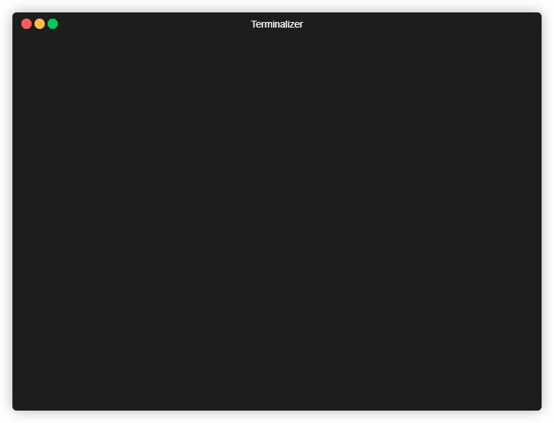

# BPStegano


```
_______  _______ _______ __
|   _   \|   _   |   _   |  |_.-----.-----.---.-.-----.-----.
|.  1   /|.  1   |   1___|   _|  -__|  _  |  _  |     |  _  |
|.  _   \|.  ____|____   |____|_____|___  |___._|__|__|_____|
|:  1    |:  |   |:  1   |          |_____|
|::.. .  |::.|   |::.. . |
`-------'`---'   `-------'
```

BPStegano is a steganography tool created by students at Rowan University for their graduate cryptography class.

## Authors
**Tapan Soni** - *Principle Developer* - [TapanSoni](https://github.com/TapanSoni)

**Richard Baird** - *Principle Developer* - [RickBaird](https://github.com/RickBaird)

**Kriyanshi Patel** - *Developer*

## Features
1) AES-128-CFB encryption of input data
2) Random Least Significant Bit (LSB) pixel encoding
3) Supports plain text (raw string) data hiding
4) Supports the hiding of multiple files of any type (.pdf, .exe, .jpg, .png, .txt, .gif, etc.)

## Installation

*Python 3.6.8 or higher is required to run BPStegano*


```bash
git clone https://github.com/TapanSoni/BPStegano

cd BPStegano

pip install -r requirements.txt
```


## Usage

Windows

```python
python stegano.py
```

Linux
```python
python3 stegano.py
```

#### Hiding raw strings inside an image

BPStegano supports raw strings of any length (limited only by the size of the image).



#### Hiding files inside an image

BPStegano supports hiding of any type of file and any amount (limited only by the size of the image) inside an image.


#### Extracting raw strings from an image

BPStegano extracts the raw string and displays it for you in terminal.


#### Extracting files from an image

BPStegano only requires the secret key and the encoded image. It will recognize whether an image is hiding a raw string or files inside it.


## Image comparison

#### Raw string

|truck.png (Original)|plain_text.png (Modified)|
|--------------------|-------------------------|
|||

*truck.png source*: https://www.tesla.com/xNVh4yUEc3B9/04_Desktop.jpg

|Image|SHA256|
|----------|------|
|truck.png|2db4a6d1e195dd4e26ea1a69b10977b0889dd5e48db30ddd3fd77d70dfd6eb9f|
|plain_text.png|13b6d99758cfe69cec507561b41a87cc7832b2339bfdcdac15f74a9bde7fd489|


#### Files

|shuttle.png (Original)|files.png (Modified)|
|--------------------|-------------------------|
|||

*shuttle.png source*: https://images-assets.nasa.gov/image/8898508/8898508~orig.jpg

|Image|SHA256|
|----------|------|
|shuttle.png|9b03df019b722003061ec52ab207bff7e69fea23d42b62765ce8d4820d122f70|
|files.png|71de2439a46c3ed424e9ed477b5c1ef0e52e23d9bafbf615511033085cd0f13e|

## Contributing
Pull requests are welcome. For major changes, please open an issue first to discuss what you would like to change.

## Disclaimer
This software is provided as is. Neither the authors or Rowan University take any responsibility whatsoever for any action performed by a user of this software, or any actions performed by this software outside of the user's control, intentionally or unintentionally.
